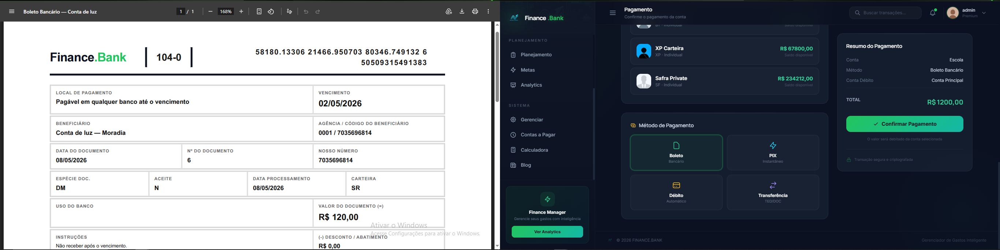
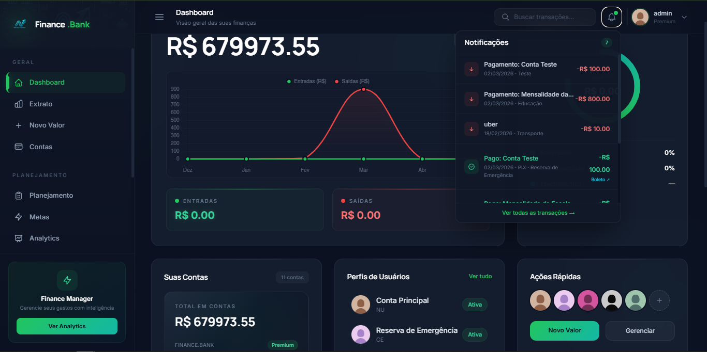
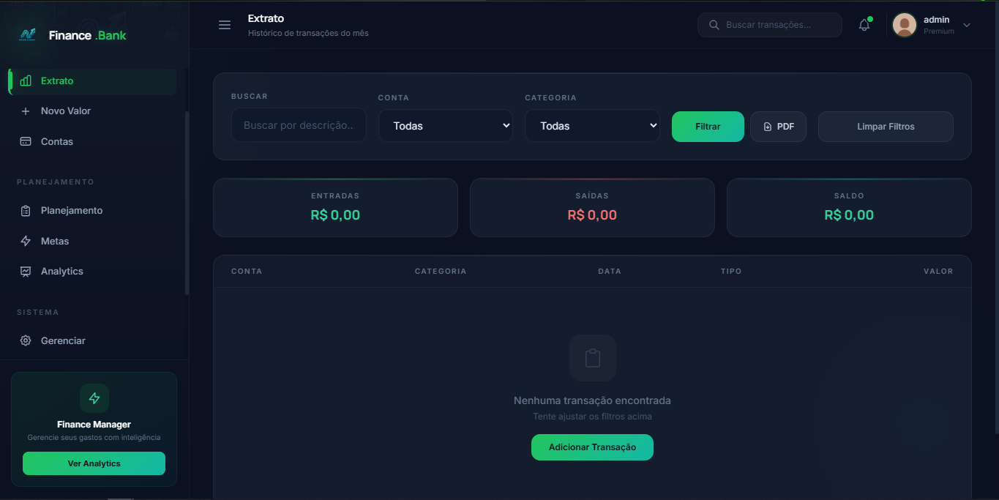
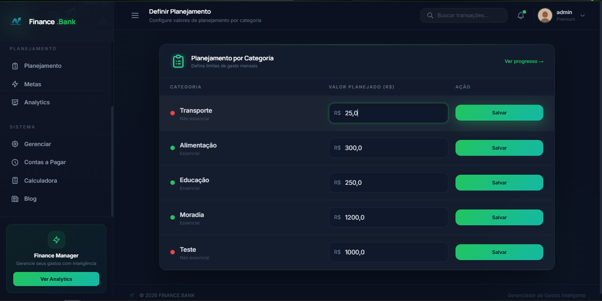

<div align="center">

  
  
  
  
  
  

  <br/><br/>

  <h1>FINANCE.BANK</h1>
  <p><strong>Gestão Financeira Pessoal com Estética Institucional Dark-Mode</strong></p>

  

</div>

---

## Sobre o Projeto

**FINANCE.BANK** é uma aplicação web de gestão financeira pessoal construída com o ecossistema Python e Django. O objetivo do sistema é permitir o controle de finanças utilizando uma interface moderna com estética corporativa institucional e design em _glassmorphism_. Serve para registro de contas, fluxos de caixa e geração de relatórios tabulares em PDF gerados on-the-fly, acompanhados de dashboard gerencial.

---

## Telas do Sistema

### 1. Dashboard Principal


### 2. Extrato e Movimentações


### 3. Orçamento e Planejamento


### 4. Blog & News


---

## Stack Tecnológica

| Componente | Ferramenta / Linguagem | Descrição |
|-----------|------------------------|-----------|
| **Backend Core** |   | Lógica de servidor, roteamento e gerenciamento ORM interno. |
| **Banco de Dados** |  | Banco relacional rápido para arquivos persistentes em disco. |
| **Geração de PDF** |  | Engine binário de interpretação de estilos para documentos portáteis PDF de alta fidelidade. |
| **Interface de Usuário** |   | Código padrão de interação visual, DOM manipulado diretamente no navegador. |
| **Gráficos** |  | Analytics implementados via _canvas_, gerando áreas poligonais e gauges de saúde orçamentária. |
| **Estilo e Layout** |  | Configuração de variáveis unitárias importadas e mapeadas em CDN externo para UI. |

---

## Funcionalidades e Módulos Estruturais

| Módulo de Lógica | Descrição da Funcionalidade Injetada |
|------------------|---------------------------------------|
|  | Consolidador universal de saldos e medidor de equilíbrio econômico global do usuário. |
|  | Camada em lista interativa para pagamentos retroativos. Renderiza saídas HTML customizadas para matriz de WeasyPrint. |
|  | IA básica baseada em array contextual: Escaneia strings na origem e preenche o form dinamicamente no _frontend_ antes de salvar (API REST Local). |
|  | Listagem inteligente programática; segrega as cobranças em vetores de: _Vencidas_, _Prioritárias (5d)_ e _Status Ok_. |
|  | Monitoramento teto-limite de carteira injetada _per_ tag baseada em calculo volumétrico predefinido ou flexível. |

---

## Rotas de Acesso Mapeadas (Tabela de URLs)

| Endpoints de Rota Mapeada | Aplicação Responsável | Fluxo do Usuário / Contexto de Acionamento |
|--------------|-----------|------------------------|
| `/perfil/home/` | app: Perfil | Apresentação universal consolidada e alertas de risco |
| `/perfil/dashboard/` | app: Perfil | Analytics estendido carregando a matriz de Chart.js |
| `/perfil/gerenciar/` | app: Perfil | Gerenciar cadastros de cartões lógicos da plataforma |
| `/extrato/novo_valor/` | app: Extrato | Formulário de transação monetária principal e entrada |
| `/extrato/view_extrato/` | app: Extrato | Grid detalhado de logs da movimentação passiva e ativa |
| `/extrato/exportar_pdf/` | app: Extrato | Engine de compressão binária, retorna cabeçalho de tipo _application/pdf_ |
| `/contas/ver_contas/` | app: Contas | Viewer do escopo passional listado de faturamento a pagar agendado |
| `/planejamento/ver_planejamento/` | app: Planejamento | Barra analítica colorada (Safe Zone e Alert Zone) ativamente traqueada |
| `/perfil/api/sugerir_categoria/` | app: Perfil | Receptor micro-serviço (API Local) do escopo JS para parsear categorizações automáticas |

---

## Deploy e Setup em Ambiente Local

**1. Clone o repositório raiz na sua rede ou terminal:**
```bash
$ git clone https://github.com/PedroSantosCode/FINCANCE.git
$ cd FINCANCE
```

**2. Provisionamento seguro de sub-rede Python:**
```bash
# Ambiente Microsoft Windows (Cmd/Powershell)
$ python -m venv .venv
$ .venv\Scripts\activate

# Ambiente Linux / Darwin (MacOS) Baseados em Bash ou Zsh
$ python3 -m venv .venv
$ source .venv/bin/activate
```

**3. Instalação e Montagem do Build Dependencies:**
```bash
$ pip install -r requirements.txt
```

**4. Rotina Inicial de Migrações do ORM (Estruturação Relacional Sqlite3):**
```bash
$ python manage.py migrate
```

**5. Setup da Secret e Run Server TCP (Virtualização no Navegador):**
*OBS: Verifique configurações de variáveis `.env` na montagem local se baseadas no escopo do repositório em modo debug global.*
```bash
$ python manage.py runserver
```

Acompanhe através da URL interna disparada na _network_ isolada:
`http://localhost:8000`

---

### Módulos Estendidos

Para sincronizar o script assíncrono programado a debitar laços da fatura recorrente do respectivo ciclo e período:

```bash
$ python manage.py processar_recorrencias
```

---
<div align="center">
  Desenvolvido sob Arquitetura e Engenharia de Software no Ecossistema da Linguagem Python &bull; 2026
</div>

